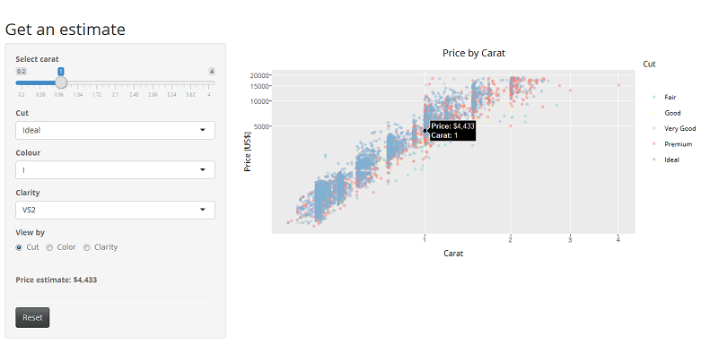

Diamonds
========================================================
author: Evelyn Baskaradas
date: 3 May 2017
autosize: true
font-family: "Palatino Linotype", "Book Antiqua", Palatino, serif

A Price Estimator Application

<small>Developing Data Products Course Project  
Shiny Application and Reproducible Pitch</small>

Diamond Quality
========================================================
type: custom

The 4Cs of Diamond Quality, **Cut**, **Colour**, **Clarity**, and **Carat Weight**, is the universal method for assessing the quality of any diamond.

A diamond's **cut** determines the quality of its light reflected and is graded on a Fair - Ideal scale.

Diamond **colour** actually refers to the *lack* of colour and is graded on a D - Z scale of colourless to lightly coloured.

Diamond **clarity** indicates the absence of inclusions and blemishes and is graded on an FL - I^3 scale of Flawless to Included.

Diamond **carat weight** measures a diamond's apparent size. A metric "carat" is defined as 200 milligrams.

Price and Carat Weight
========================================================
type: custom

The largest influence on diamond prices is carat weight; however cut, colour and clarity are impacting factors as well. As larger diamonds are less commonly available, the price of diamonds increases exponentially with respect to carat weight.

Getting an Estimate
========================================================
type: custom

The **Diamond Price Estimator** application gives a view of diamonds priced by carat in a linear pattern, enabling the user to evaluate the price fluctuations at set carat values determined by cut, colour, and clarity.

Try the Application
========================================================
type: custom

The advised estimates are reasonably within range of actual* prices, as illustrated below.
<table>
 <thead>
  <tr>
   <th style="text-align:right;"> Carat </th>
   <th style="text-align:left;"> Cut </th>
   <th style="text-align:center;"> Colour </th>
   <th style="text-align:center;"> Clarity </th>
   <th style="text-align:right;"> Actual* Price US$ </th>
   <th style="text-align:right;"> Estimated Price US$ </th>
  </tr>
 </thead>
<tbody>
  <tr>
   <td style="text-align:right;"> 0.70 </td>
   <td style="text-align:left;"> Very Good </td>
   <td style="text-align:center;"> D </td>
   <td style="text-align:center;"> VS2 </td>
   <td style="text-align:right;"> 2960 </td>
   <td style="text-align:right;"> 3080 </td>
  </tr>
  <tr>
   <td style="text-align:right;"> 1.02 </td>
   <td style="text-align:left;"> Premium </td>
   <td style="text-align:center;"> G </td>
   <td style="text-align:center;"> SI2 </td>
   <td style="text-align:right;"> 4370 </td>
   <td style="text-align:right;"> 4058 </td>
  </tr>
  <tr>
   <td style="text-align:right;"> 0.71 </td>
   <td style="text-align:left;"> Good </td>
   <td style="text-align:center;"> E </td>
   <td style="text-align:center;"> SI1 </td>
   <td style="text-align:right;"> 2606 </td>
   <td style="text-align:right;"> 2462 </td>
  </tr>
</tbody>
</table>

 
The **Diamond Price Estimator** application is a useful interactive tool which enables the user to define combinations of diamond characteristics and receive a price estimate instantly.

[Get the app!](https://evelynb7.shinyapps.io/diamonds/)

[Get presentation code](http://github.com/evelynb7/diamondsPitch.git)

* This application uses the <b>diamonds</b> dataset included in the <code>ggplot2</code> R package and should not be taken to be a true representation of current market diamond prices.

